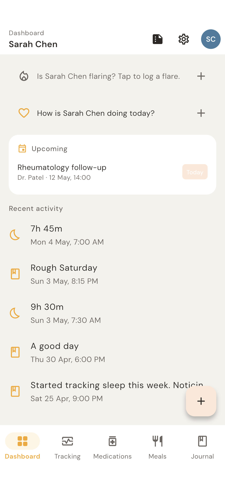
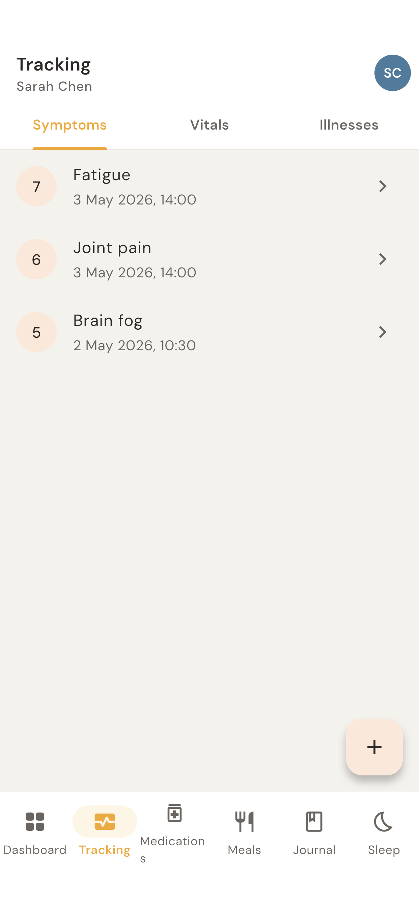
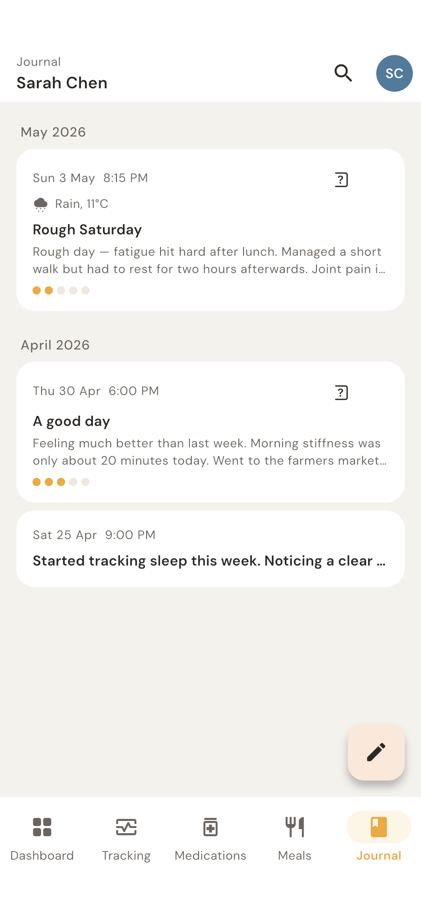

  

  <strong>A calm, private health journal for people living with chronic illness, and the people who care for them.</strong>

  <a href="https://apps.apple.com/app/health-flare/id6803123766">App Store</a> ·
  <a href="https://play.google.com/store/apps/details?id=org.healthflare.app.healthflare">Google Play</a> ·
  <a href="https://github.com/Health-Flare/app/releases/latest">Latest release</a> ·
  <a href="https://healthflare.org">healthflare.org</a>

  
  
  
  

  
  
  

## What it does

Log symptoms, vitals, medications, meals, and journal entries in one place. When your next appointment comes around, export a PDF or CSV and walk in with a clear picture of how you've actually been, not just what you remember in the waiting room.

One install can track more than one person: yourself, a child, a parent, a partner. Each profile's data is kept separate.

Health Flare is a journal, not a medical device. It doesn't diagnose, prescribe, or give clinical advice.

Not sure it fits? These walk through real situations:

- [Tracking your own illness](https://healthflare.org/for/tracking-your-own-illness/)
- [Tracking for your child](https://healthflare.org/for/tracking-for-your-child/)
- [Caring for family and yourself](https://healthflare.org/for/caring-for-family-and-yourself/)

## Privacy

- No account. No login. Ever.
- No cloud sync. Everything is stored on your device.
- No analytics, no telemetry, no ads.
- No server of ours. Your records are included in your phone's own backup (iCloud or Google) if you use one; otherwise they leave your device only when you export or share them. Exports can be password-locked (AES-256-GCM, encrypted on-device).
- One opt-in exception: if you turn on weather capture, your approximate location (rounded to about 1 km) is sent to [Open-Meteo](https://open-meteo.com) to look up conditions. Your records are never sent, and the location is never stored.

Full policy: [healthflare.org/privacy](https://healthflare.org/privacy). Why it's built this way: [Free, offline, and not for sale](https://healthflare.org/blog/free-offline-and-not-for-sale/).

## Get it

- **iPhone and iPad:** [App Store](https://apps.apple.com/app/health-flare/id6803123766)
- **Android:** [Google Play](https://play.google.com/store/apps/details?id=org.healthflare.app.healthflare), or the APK from [GitHub Releases](https://github.com/Health-Flare/app/releases/latest)

  To check a downloaded APK is ours, its signing certificate's SHA-256 should be
  `7e:63:a6:89:1b:25:29:96:a6:ac:df:cd:c9:3a:dc:03:d6:f0:cc:9f:53:74:08:e8:5e:8c:c9:74:a7:6b:5a:6a`
  (`apksigner verify --print-certs healthflare-vX.Y.Z.apk`). Play Store installs are signed by Google with a different key.
- **Desktop and web:** planned

What changed in each version: [CHANGELOG.md](CHANGELOG.md).

## Help and feedback

- Found a bug or want something? [Open an issue](https://github.com/Health-Flare/app/issues/new/choose).
- Security problem? Please don't open a public issue. Email security@healthflare.org. See [SECURITY.md](SECURITY.md).
- Privacy question: privacy@healthflare.org.

## Support the project

Health Flare is free, with no ads and no data to sell. If it helps you, you can [sponsor Health Flare on GitHub](https://github.com/sponsors/Health-Flare). Other ways to give, and where the money goes, are in [FUNDING.md](FUNDING.md).

## Contributing

Contributions are welcome. Start with [CONTRIBUTING.md](CONTRIBUTING.md) for the ground rules, then [docs/development.md](docs/development.md) to build and run the app. Behaviour is specified in plain-language Gherkin files in [`docs/features/`](docs/features/), which double as a readable tour of what the app does.

Built with Flutter, Riverpod, and Isar.

[Inner Flare](https://github.com/Health-Flare/InnerFlare) is a cycle tracker built on the same privacy rules.

## Acknowledgements

The way Health Flare asks about symptoms comes from [Dr Cat Hicks](https://www.drcathicks.com). She pointed us to PROMIS and the research behind it, and her [Informed Patient](https://github.com/DrCatHicks/informed-patient) skill (CC BY 4.0) showed how to turn that research into questions a person can answer: how intense a symptom was and how much it got in the way are recorded separately, you can say what it stopped you doing in your own words, and the form ends with "anything else?". Thank you, Cat. Sources are in the app under **Settings → Where our questions come from**.

## License

Health Flare is free software under the [GNU GPL v3.0](LICENSE.md) or later. Third-party licenses are in [THIRD_PARTY_NOTICES.md](THIRD_PARTY_NOTICES.md) and in the app under **Settings → Open source licenses**.

The Health Flare name and logo are trademarks of Automated Bytes Incorporated and aren't covered by the GPL. Forks are welcome under their own name and icon. See [TRADEMARKS.md](TRADEMARKS.md).
